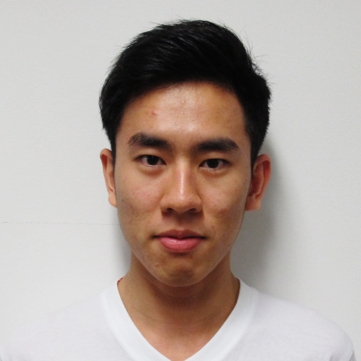

## About Me

I'm a research student in statistics at The University of Western Australia. My
current projects are focusing on shape-constrained regression. Previously, I was
an engineering student but realised that statistics is more interesting!

I'm originally from Malaysia where I lived there until I started my university
in 2013. I speak Mandarin as well! My surname "Ng" is pronounced as *ung*
without the vowel sound. It's the Hokkien (a Chinese dialect) pronunciation of
黄, which stands for *yellow* in English.

## Research Interest

My area of interests is statistics and machine learning. I personally find no
difference between these two; they only differ by their philosophy: statistics
infers, machine learning predicts.

Here is a list of my (more specific) research interests (and it's growing):
* Bayesian statistics;
* Nonparametric models;
* Markov chain Monte Carlo methods;
* Optimisation.

## Research Papers

Ng, K., Turlach, B. A. and Murray, K. (2019). A flexible sequential Monte Carlo
algorithm for parametric constrained regression, *Computational Statistics &
Data Analysis*. [DOI](https://doi.org/10.1016/j.csda.2019.03.011), [arXiv](https://arxiv.org/abs/1810.01072)

## Projects

I'm currently working
with [Berwin A. Turlach](http://www.maths.uwa.edu.au/~berwin)
and [Kevin Murray](https://www.uwa.edu.au/Profile/Kevin-Murray) on two projects:

1. Flexible optimisation routines for shape-constrained regression;
2. Longitudinal modelling with shape-constrained penalised splines.

<!-- ## Typography -->

<!-- This is a [link](http://google.com). Something *italics* and something **bold**. -->

<!-- Here is a table -->

<!-- Year | Award | Category -->
<!-- -----|-------|-------- -->
<!-- 2014 | Emmy  | Won Outstanding Lead Actor in a miniseries or a movie -->
<!-- 2015 | BAFTA | Nominated for Best Leading Actor for Sherlock -->
<!-- 2014 | Satellite | Won Best Actor miniseries or television film -->

<!-- Here is a horizontal rule -->

<!-- --- -->

<!-- Here is a blockquote -->

<!-- > To a great mind, nothing is little -->

<!-- ## References -->

<!-- * Foo Bar: Head of Department, Placeholder Names, Lorem -->
<!-- * John Doe: Associate Professor, Department of Computer Science, Ipsum -->
